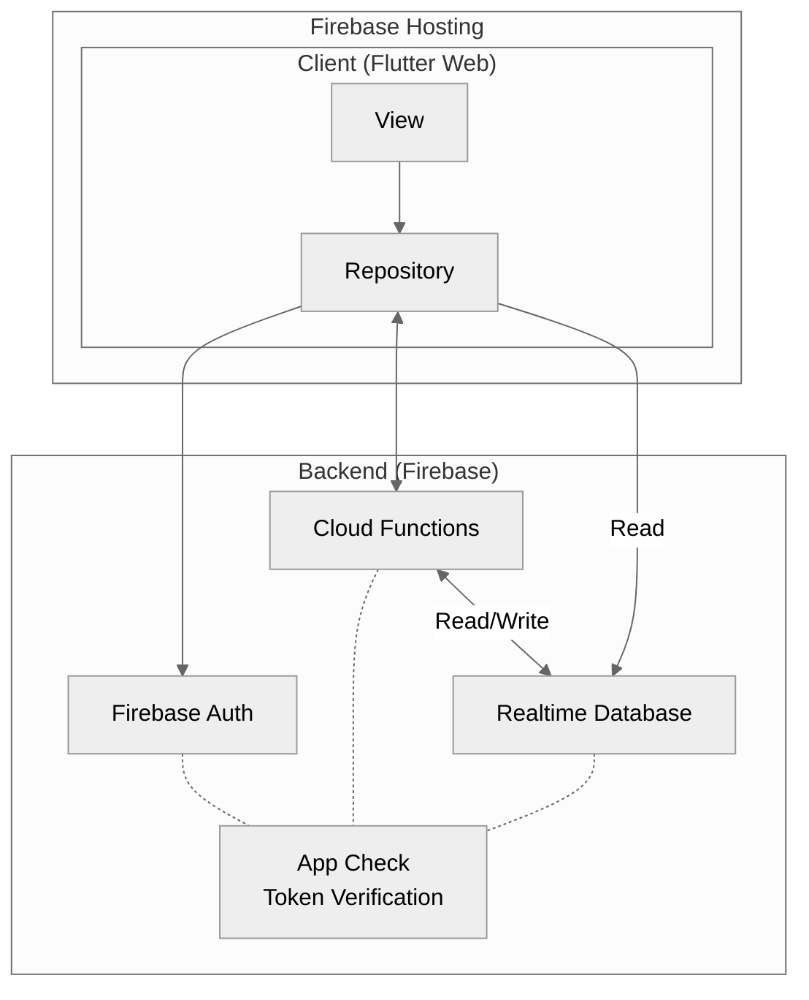
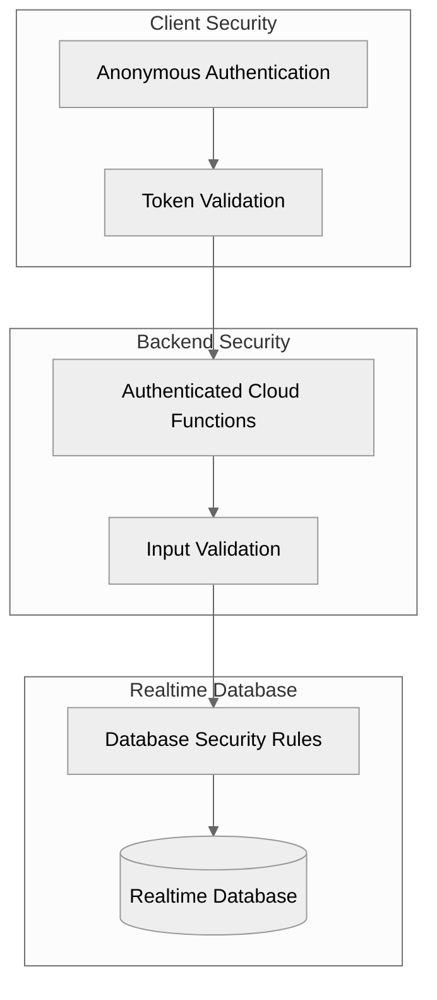
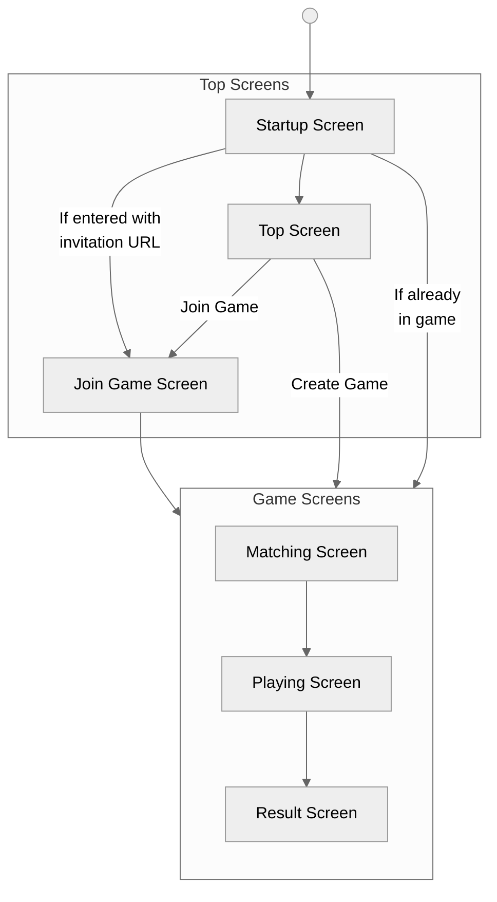
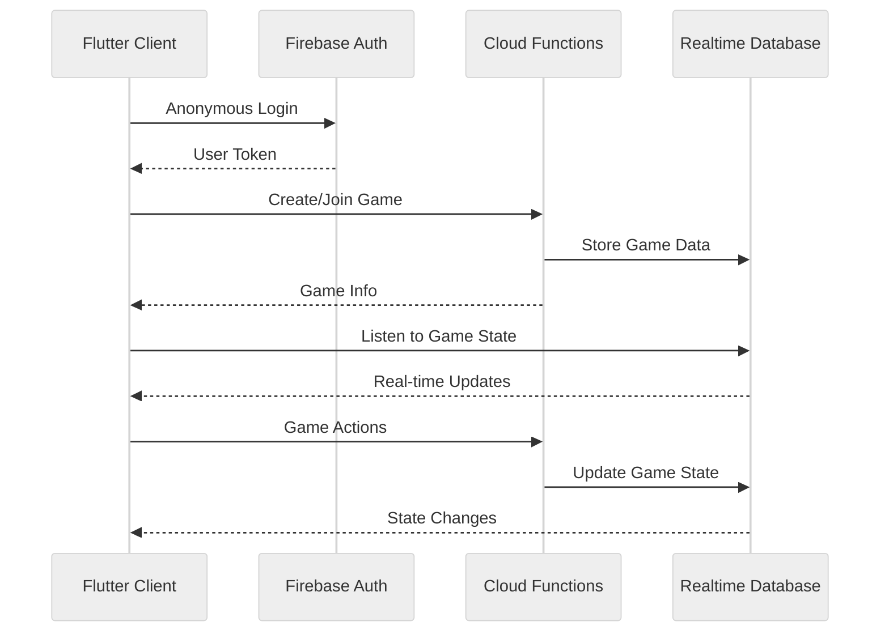

# System Architecture Documentation

This document outlines the system architecture of the Flutter Online Card Game project using Mermaid diagrams.

## System Architecture

## Security Architecture

## Screens

## Data Flow Architecture

